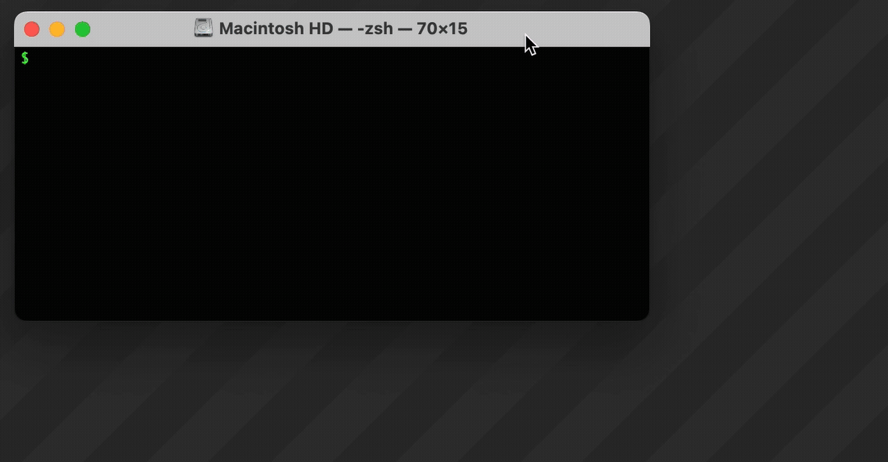

# JSP Templates Documentation

A collection of web experiments using the [jsPsych library](https://www.jspsych.org/). 

- [Transcription Task](/transcription_task.md)
- [Forced Choice Task](forced_choice_task.md)
- [Flanker Task](flanker_task.md)
- [Background Noise Task](bg_noise.md)

## Overview
Each template is a single standalone html file that can be run in a browser. In some cases, some accompanying files may be required such as audio file which will be available in the same folder.

## Firebase
The quickest way to get a web experiment up and running is to sign up for a [Firebase](https://firebase.google.com) account. 
- Create a new Firebase project.
- Select Realtime Database, select desired location, click 'OK'
- Initiate the web app, enter a name for the web app

You should see your project specific Firebase config object that will look something like this:

```js
const firebaseConfig = {
  apiKey: "1234ABCD",
  authDomain: "your-project-id.firebaseapp.com",
  databaseURL: "https://your-project-id-default-rtdb.firebaseio.com",
  projectId: "your-project-id",
  storageBucket: "your-project-id.firebasestorage.app",
  messagingSenderId: "1234567",
  appId: "1234ABCD"
};
```
This block of code will need to be added to your web experiment template. Instructions for this are available in the web template specific pages.

## Deployment
Download and install the following:
- [Node and NPM](https://nodejs.org/en)
- [Firebase CLI](https://firebase.google.com/docs/cli/)

From a terminal or shell window, "cd" (which stands for change directory) to the root path of your project

```bash
cd /path/to/your/local/project/
```
?> Tip: You can drag and drop folders into your terminal window



To set up the Firebase deployment pipeline 
```bash
firebase login
```

If prompted with "Allow Firebase to collect CLI and Emulator Suite usage and error reporting information? (Y/n)", enter "N" for no.

This will launch your default browser and prompt you to log in with your Firebase account.

Next, if this is the project's first time interacting with Firebase, you will need to run the following:
```bash
firebase init
```
- Using the arrow keys, scroll down to "Hosting: Configure files for Firebase Hosting and (optionally) set up GitHub Action deploys" and use the spacebar to select.
- Next, select "Use an existing project".
- Using the arrow keys select your project.
    - 'What do you want to use as your public directory?' prompt, enter a forward slash ('/').
    - 'Configure as a single-page app (rewrite all urls to /index.html)?' prompt, enter 'N'.
    - 'Set up automatic builds and deploys with GitHub?' prompt, enter 'N'
    - 'File //index.html already exists. Overwrite?', enter 'N'


Finally, run the deploy command
```bash
firebase deploy
```
This will upload the html files to firebase and will generate a public URL (e.g. https://my-project.web.app) which can be distributed to online participants.