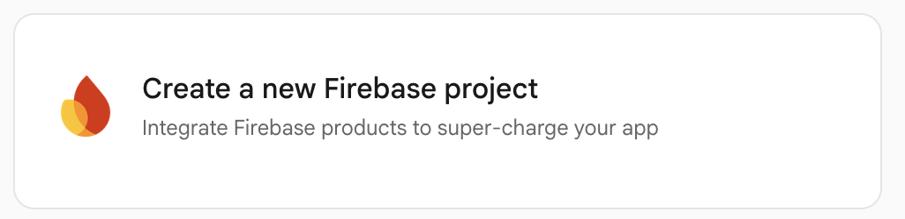
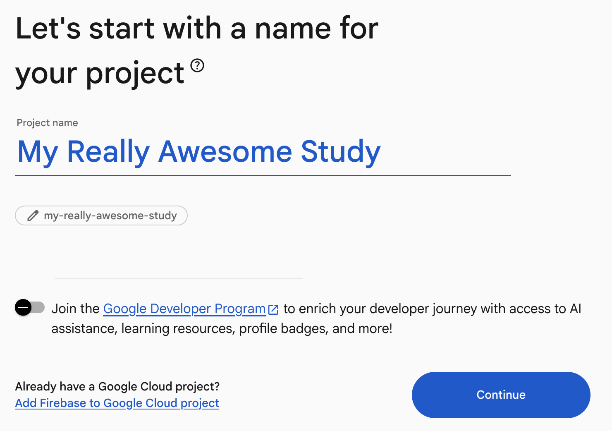
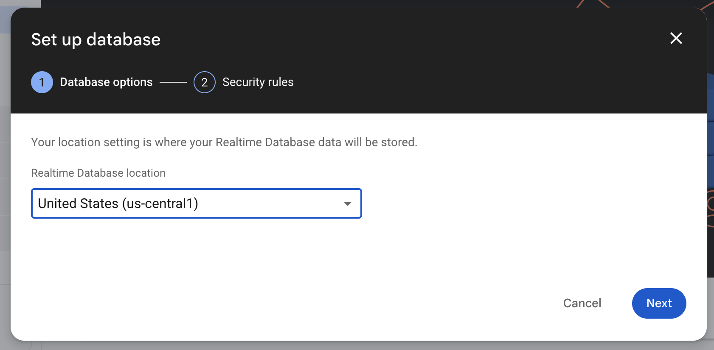
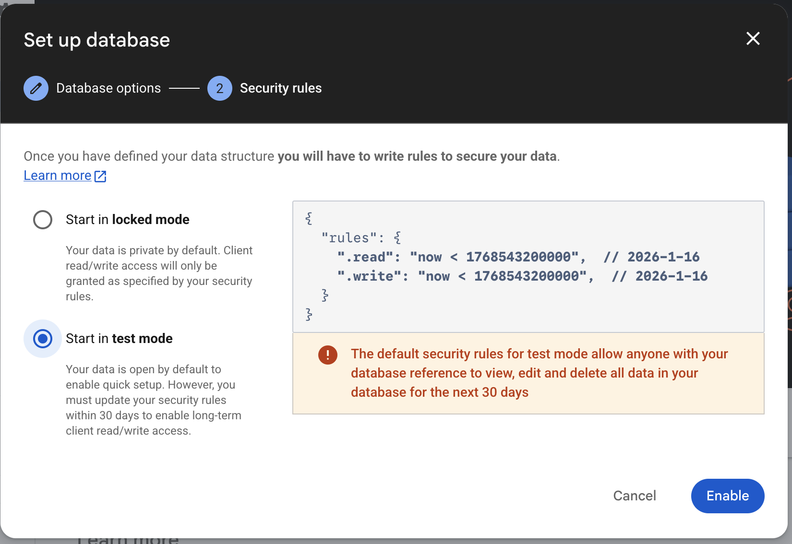
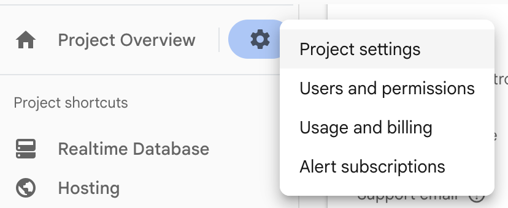
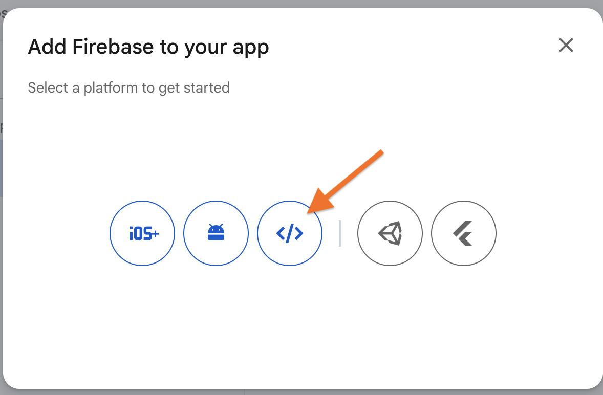
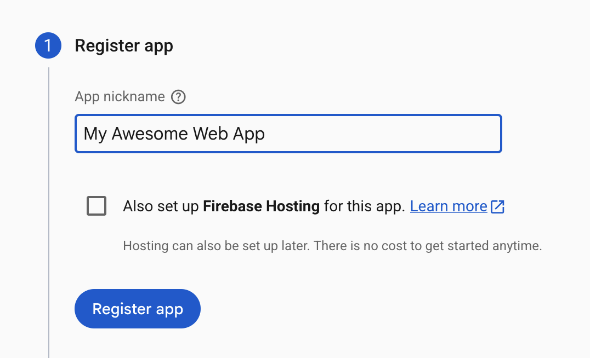
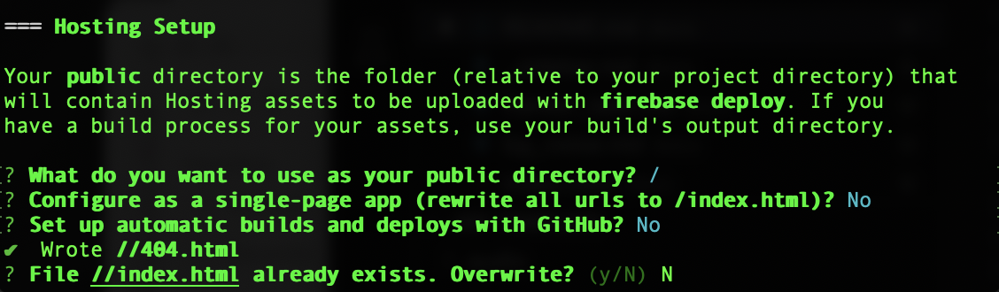

# Firebase Setup

## Create a new Firebase project

</img>

- Enter a project name
- Unselect the "Join the Google Developer Program" toggle

</img>

## Setup Realtime Database

- From the Build section of left navigation menu, select "Realtime Database" -> "Create Database" and select "United States"as the location. 

</img>
</img>

- Select "Start in Test Mode" for Security Rules (stronger rules are available in the template folders)

</img>

## Obtain Firebase Config Object

- Click the gear icon next to "Project Overview" and select "Project Settings".

</img>

- Select the web </> icon.

</img>


- Enter a nickname for the web app, then click "Register app".

</img>

You should no see your project specific Firebase config object that will look something like this:

```js
const firebaseConfig = {
  apiKey: "1234ABCD",
  authDomain: "your-project-id.firebaseapp.com",
  databaseURL: "https://your-project-id-default-rtdb.firebaseio.com",
  projectId: "your-project-id",
  storageBucket: "your-project-id.firebasestorage.app",
  messagingSenderId: "1234567",
  appId: "1234ABCD"
};
```
This block of code will need to be added to your web experiment template. Instructions for this are available in the web template specific pages.

## Deployment
Download and install the following:
- [Node and NPM](https://nodejs.org/en)
- [Firebase CLI](https://firebase.google.com/docs/cli/)

From a terminal or shell window, "cd" (which stands for change directory) to the root path of your project

```bash
cd /path/to/your/local/project/
```
?> Tip: You can drag and drop folders into your terminal window


To set up the Firebase deployment pipeline 
```bash
firebase login
```

If prompted with "Allow Firebase to collect CLI and Emulator Suite usage and error reporting information? (Y/n)", enter "N" for no.

This will launch your default browser and prompt you to log in with your Firebase account.

Next, if this is the project's first time interacting with Firebase, you will need to run the following:
```bash
firebase init
```
- Using the arrow keys, scroll down to "Hosting: Configure files for Firebase Hosting and (optionally) set up GitHub Action deploys" and use the spacebar to select.
- Next, select "Use an existing project".
- Using the arrow keys select your project.
    - 'What do you want to use as your public directory?' prompt, enter a forward slash ('/').
    - 'Configure as a single-page app (rewrite all urls to /index.html)?' prompt, enter 'N'.
    - 'Set up automatic builds and deploys with GitHub?' prompt, enter 'N'
    - 'File //index.html already exists. Overwrite?', enter 'N'




Finally, run the deploy command
```bash
firebase deploy
```
This will upload the html files to firebase and will generate a public URL (e.g. https://my-project.web.app) which can be distributed to online participants.